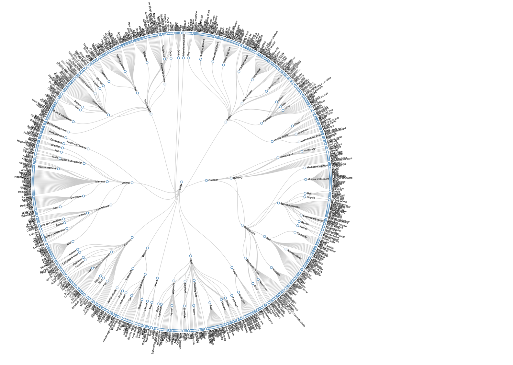

# Google_Open_Images_V7
Google OpenImages V7 is an open source dataset of 9.2 million images annotated with image-level labels, object bounding boxes, object segmentation masks, and visual relationships. It is the largest existing dataset with object location annotations. The dataset is released under the Creative Commons Attribution 4.0 International (CC BY 4.0) license, which allows for both commercial and non-commercial use. It is available for download from the Google Cloud Platform.

Using Google OpenImages V7 is easy. First, you need to download the dataset from the Google Cloud Platform. Once the dataset is downloaded, you can use the annotations to train your own image recognition models. You can also use the annotations to create your own image datasets. Additionally, you can use the annotations to evaluate the performance of your models. Finally, you can use the annotations to create visualizations or to develop applications that use image recognition.

### **Google_Open_images_V7 dataset download link** 👇👇

**https://storage.googleapis.com/openimages/web/download_v7.html**

### **View the set of boxable classes as a hierarchy**
https://storage.googleapis.com/openimages/2018_04/bbox_labels_600_hierarchy_visualizer/circle.html

